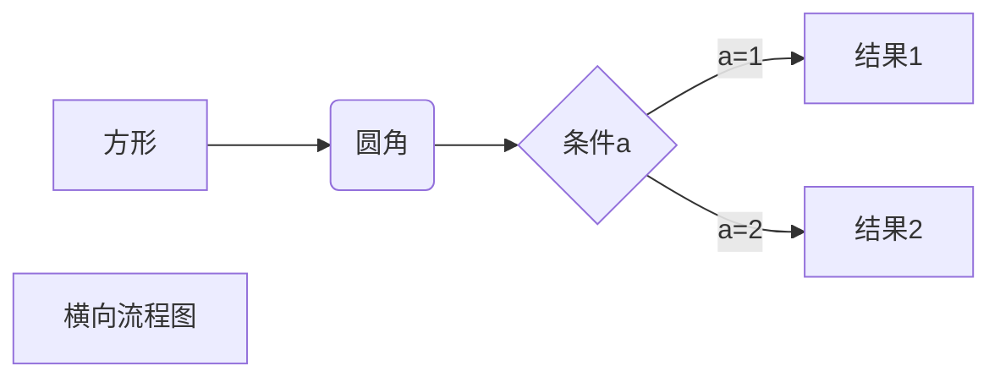

# 第一天学习内容
## 1.单行注释  
> * 单行注释: #号  
> 例:这是一个注释
> * 多行注释: '''或者"""  
> 例:  
> '''  
> 第一行注释  
> 第二行注释  
> '''
## 2.公式

```mermaid
graph LR
A[方形] -->B(圆角)
    B --> C{条件a}
    C -->|a=1| D[结果1]
    C -->|a=2| E[结果2]
    F[横向流程图]
```